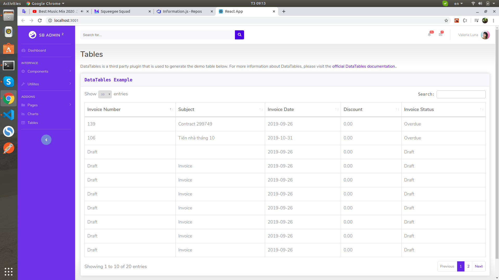

# linxone-reactjs-sample
This is a sample project, demonstrating the use of reactjs for web app front end. Backend is our LinxOne ERP Web Services API (REST-ful)
# these packages used in this project

@fortawesome/fontawesome-svg-core : 1.2.27
@fortawesome/free-solid-svg-icons : 5.12.1
@fortawesome/react-fontawesome : 0.1.8
axios : 0.19.2
node-sass : 4.13.1
react-js-pagination : 3.0.2
react-redux : 7.1.3
react-router-dom : 5.1.2
redux : 4.0.5"

# the screenshot for demo

